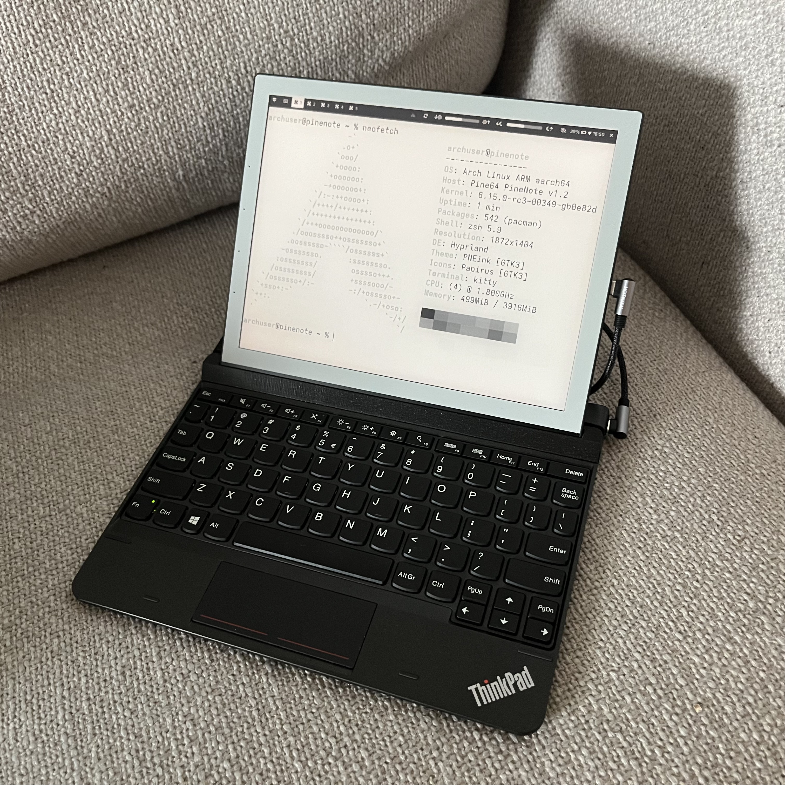
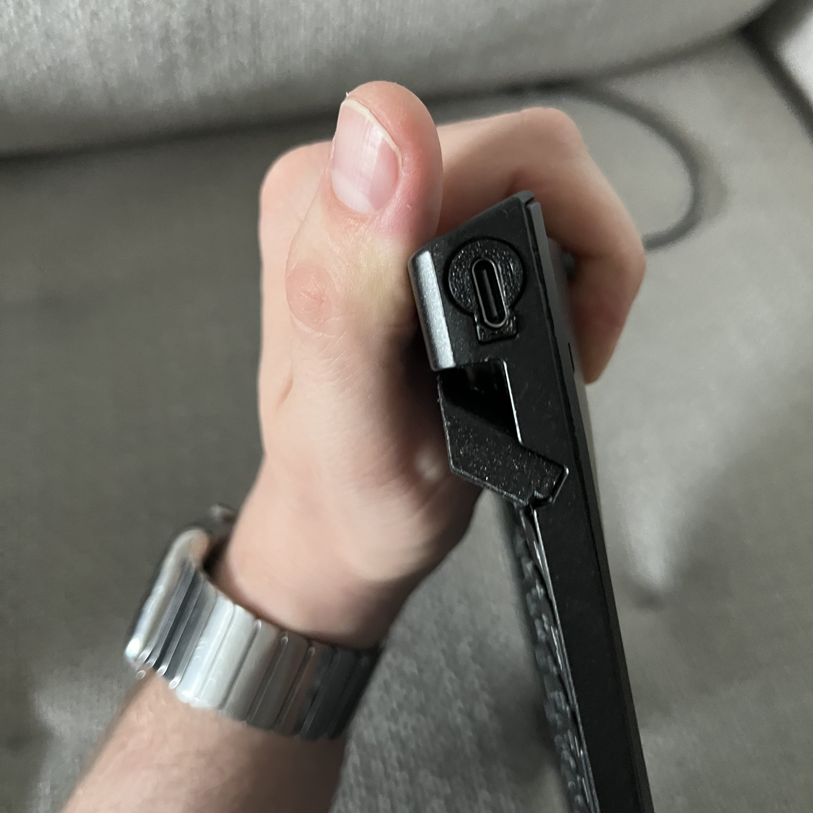
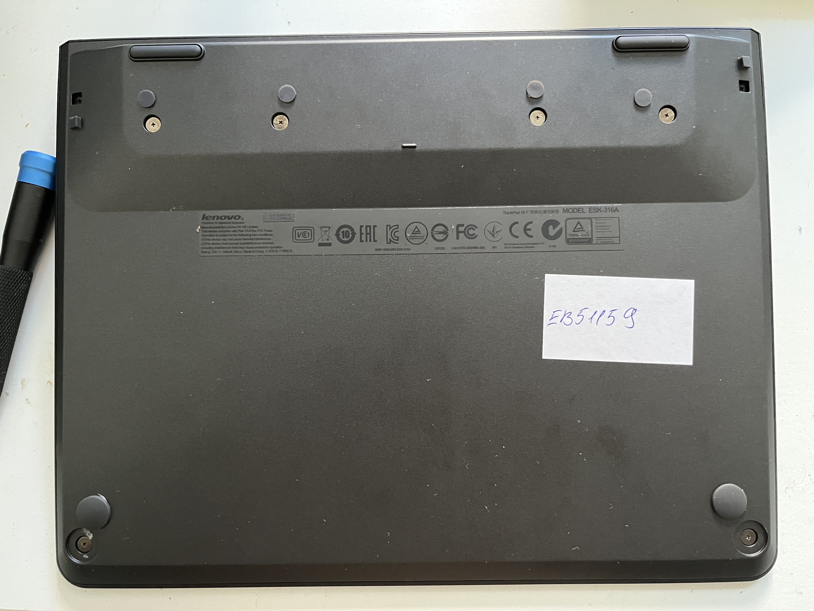

# PineNote -> ThinkPad 10 Ultrabook Keyboard adapter



## Printing

[**STLs here**](stl/)

0.15 mm layer height, support on build plate only. Print with screw holes facing down.
I used Prusa Galaxy Gray PETG filament for the tablet holder part since this gave me a quite good color match. Matte Black PETG worked quite well too. PLA should also work, but I only used that for testing the fit.
## Materials, off-the-shelf
- 1x Lenovo ThinkPad 10 Ultrabook keyboard (model ESK-316A)
- 4x M2x8 bolts
- 4x M2 hex nuts
- 4x M2 washers
- 1x _sacrificial_ USB cable (can probably use any random 4 wires, it's not even USB 2.0 speed)
- 1x USB-C socket (I used a socket with 2x 5.1 kΩ resistors on CC pins installed)
- hot glue to secure things 🤣
### Installation
Remove the outside screws hidden underneath rubber stoppers. There are 2x small screws in the corners of the "thick" side, 4x large screws in the "bump" part itself and 2x large screws in the palm rest corners.



Pry the bottom case off. **Be careful, use gloves! There are sharp edges inside!** Also, this will require a bit more strength than expected - you will break a few plastic welds (I have not found a way to avoid this.)
You should be seeing the original PCB controller and connector inside.


Remove the black tape from the controller PCB. You will see a LOT of test points. For this mod you need: `VCC_5V`, `GND`, `D+`, and `D-`. Using a soldering iron, connect the respective USB lines to the test points. You can see the location on the scan below. Solder the other side of the cable to your USB-C socket.


After soldering, you can test the keyboard by plugging in the cable. Once everything is confirmed working, secure the wires and USB-C socket with hot glue and/or kapton tape. Do it **as soon as possible** - it's easy to lift those pads off the board by accident (if that happens, you can still solder to the traces on the other side, it's just way more difficult). 


Remove the original mounting hardware, including the pogo pins. You should end up with a keyboard looking like this:


Insert a nut into one of the holes and screw in the bolt with a washer from the bottom side of the keyboard. The first one may be difficult to keep in, you can use some sticky tape to hold the nut in place. It should be easier once the first one is in place.


The finished product should look like this from the top. You can snap the bottom case back on and reinstall the screws. Slide in your PineNote, plug in the USB-C cable, and hack the planet.


## Reverse engineering: pogo pinout
```
1 2 3 4 5
o o o o|o
[   F8   ] [  F9    ]
7][  8     ]
```

| Pin no. | Role |
| ------- | ---- |
| 1       | GND  |
| 2       | GND  |
| 3       | D-   |
| 4       | D+   |
| 5       | 5V   |
## Other photos

### Front side of controller PCB


### Installed "pink" prototype


